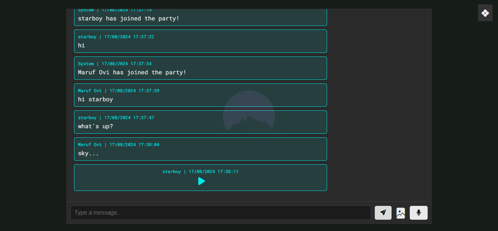

#  ChatGuys

**ChatGuys** is a real-time chat app. Chat with anyone who is using ChatGuys.

# Website/

### ChatGuys are ***[https://chatguys.onrender.com](https://chatguys.onrender.com)***  here.

## 🌸 Features

- Real-Time Messaging
- Voice Message 
- Send Images
- Message History
- Responsive Design

## ✌ Download App

App available for `Linux` and `Windows` ,

### Vist ***[Download page](https://github.com/iamovi/Chat_Guys/releases/latest)***  to download app.

## ✔ License

This project is licensed under a Proprietary License. See the [LICENSE](./LICENSE) file for more details.

## 👽 Author Info

**[Maruf Ovi](https://oviportfo.netlify.app/)**

**Moderator:** **[Tahsin](https://tahsinportfo.netlify.app/)**

***fornet.ovi@gmail.com***

---

#### ChatChat with **ChatGuys**! 💬